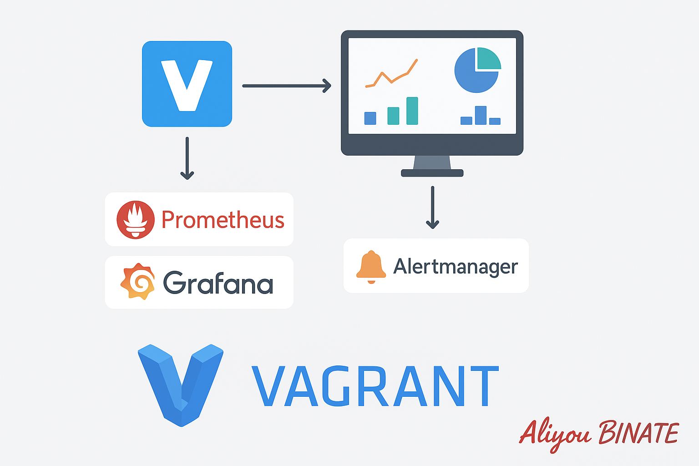

<!-- vagrant destroy -f && vagrant up -->
<!-- vagrant ssh -->

<!-- Une fois dans la VM 
cd /vagrant/provision
docker compose build demo-app
docker compose up -d
-->



<h1 align="center"><span style="color:#D24E42">MONITORING & OBSERVABILITY</span></h1>
<h2 align="center"><span style='color:#D24E42'>Stack :  Vagrant - Docker - Prometheus - Grafana - Alertmanager</span></h2>

<h2 align="center"><span style="color:#D24E42">I - INTRODUCTION</span></h2>

Ce projet a pour objectif de construire **un environnement complet et reproductible de monitoring, d’alerting et d’observabilité**, similaire à ce que l’on retrouve dans une architecture de production moderne.

Il a été conçu pour :

* **démontrer une compréhension avancée des outils de monitoring**
  (Prometheus, Grafana, Alertmanager, Node Exporter, cAdvisor),
* **montrer la capacité à instrumenter une application**
  (exposition de métriques personnalisées avec Prometheus client Python),
* **illustrer une approche DevOps professionnelle**
  via l’automatisation (Vagrant), la conteneurisation (Docker) et la structuration du code (tree propre + provisioning reproductible),
* **permettre un déploiement instantané** sur n’importe quelle machine, sans configuration préalable,
* **servir de support pédagogique** pour expliquer à un recruteur comment je mets en place un stack d’observabilité cohérent et propre.

---

<h2 align="center"><span style="color:#D24E42">II - VISION GÉNÉRALE : comment l’environnement fonctionne ?</span></h2>

Lorsque l’on lance l’environnement avec `vagrant up`, la VM installe automatiquement Docker, puis démarre un stack complet comprenant :

### **1. Une application Python instrumentée**

→ simule un service réel
→ expose des métriques internes (latence, requêtes, gauge aléatoire…) sur `/metrics`

### **2. Prometheus**

→ collecte toutes les métriques :

* de l’application
* du système (node_exporter)
* des conteneurs (cAdvisor)
* de lui-même
  → stocke les données dans une base TSDB

### **3. Grafana**

→ fournit des dashboards interactifs
→ les dashboards sont **auto-provisionnés**, ce qui prouve un niveau DevOps avancé
→ un exemple de dashboard est fourni (app + système + conteneurs)

### **4. Alertmanager**

→ gère les alertes configurées dans Prometheus
→ On pourra implémenter la notification (email, Slack, webhook…)

### **5. Node Exporter**

→ expose les métriques de la VM (CPU, RAM, I/O, filesystems…)

### **6. cAdvisor**

→ expose les métriques de performance des conteneurs Docker

---


<h2 align="center"><span style="color:#D24E42">III - ARCHITECTURE GLOBALE</span></h2>

L’environnement se compose de **trois couches**, chacune jouant un rôle clair :

---

### **Couche 1 : Provisioning de l’environnement (Vagrant)**

**Objectif :** créer une machine virtuelle reproductible, identique à chaque lancement.

**Rôle :**

* automatiser la création d’une VM Ubuntu,
* installer Docker et Docker Compose au provisioning,
* partager le code du projet dans `/vagrant`,
* créer un nid d’exécution isolé pour le monitoring.

*Capture d’écran :*
*Emplacement : `/docs/screenshots/vagrant_start.png`*
→ montrer la sortie terminal de `vagrant up`

---

### **Couche 2 : Stack Monitoring (Docker Compose)**

Cette couche orchestre les services suivants :
Prometheus, Grafana, Alertmanager, Node Exporter, cAdvisor, l’API Python.

Chaque service est packagé dans un conteneur Docker pour garantir :

* isolation,
* portabilité,
* simplicité de gestion.

*Capture d’écran :*
*`/docs/screenshots/docker_ps.png`*
→ résultat de `docker ps` montrant tout le stack up & running

---

### **Couche 3 : Observability Layer**

C’est le cœur du projet. Cette couche permet :

| Composant         | Rôle                        | Exemple de données             |
| ----------------- | --------------------------- | ------------------------------ |
| **App Python**    | Expose des métriques custom | requêtes, latence              |
| **Prometheus**    | Scrape & stock              | CPU, RAM, i/o, erreurs         |
| **Grafana**       | Visualisation               | taux d’erreur, utilisation CPU |
| **Alertmanager**  | Notifications               | alerte lorsqu’un service tombe |
| **Node Exporter** | Métriques système           | load average                   |
| **cAdvisor**      | Métriques conteneurs        | CPU par container              |

*Capture d’écran :*
*`/docs/screenshots/grafana_dashboard.png`*
→ affichage du dashboard auto-provisionné

---

## **4. Structure du projet (vue d’ensemble)**

Voici la structure exacte du projet (expliquée en détail dans la tranche suivante) :

```
monitoring-vagrant/
│
├── Vagrantfile
├── provision/
│   ├── install.sh
│   └── docker-compose.yml
│
├── prometheus/
│   ├── prometheus.yml
│   ├── alert.rules.yml
│
├── grafana/
│   └── dashboards_json/
│       └── sample-dashboard.json
│
├── python-app/
│   ├── app.py
│   ├── Dockerfile
│   └── requirements.txt
│
└── docs/
    └── screenshots/
```

Chaque fichier sera expliqué dans une section dédiée.

---

<h2 align="center"><span style="color:#D24E42">IV - DESCRIPTION DÉTAILLÉE DES COMPOSANTS</span></h2>
<h3 align="center"><span style="color:#D24E42">Vagrant - Docker - App - Prometheus - Grafana - Alertmanager</span></h3>

### 1. **Vagrantfile — L'infrastructure reproductible**

Le **Vagrantfile** sert de point d’entrée au projet. Il garantit que, peu importe la machine hôte, tu obtiens **exactement le même environnement de monitoring**.

### Objectifs :

* Créer automatiquement une VM Ubuntu.
* Installer Docker & Docker Compose via un script de provisioning.
* Monter le dossier du projet dans `/vagrant`.
* Lancer tout le stack monitoring automatiquement.

### Points clés du fichier :

* **Box utilisée** : `ubuntu/jammy64`
* **Mémoire + CPU** configurés (déterminants pour Prometheus & Grafana)
* **Provisioning shell** exécutant `provision/install.sh`
* **Forwarded ports** permettant :

  * Accès à Grafana → `localhost:3002`
  * Accès à Prometheus → `localhost:9090`
  * Accès à l’API → `localhost:5000` (si exposée)

### Pourquoi Vagrant ici ?

* industrialiser un environnement,
* indépendance vis à vis de la machine hôte,
* possibilité de “livrer” un projet de monitoring clé-en-main à n’importe qui.

**Capture d’écran :**
`docs/screenshots/vagrant_up_success.png`
→ sortie de `vagrant up` avec installation OK et lancement Docker OK.

---

### 2. **docker-compose.yml — L’orchestration des conteneurs**

Le fichier `docker-compose.yml` orchestre l’ensemble du monitoring stack.

Il démarre :

* **Prometheus**
* **Grafana**
* **Alertmanager**
* **Node Exporter**
* **cAdvisor**
* **L’API Python monitorée**

### Objectifs :

* Lancer toutes les briques d’observabilité en un seul `docker compose up -d`.
* Définir les réseaux, volumes, dépendances.
* Exposer les ports nécessaires.

### Points clés :

✔ Définit deux réseaux :

* `monitoring` → pour les composants du stack
* `backend` → pour l’application

✔ Monte les dossiers de configuration :

```
prometheus.yml
alert.rules.yml
dashboards_json/
```

✔ Associe les ports externes aux services internes :

* Grafana → 3002 → 3000
* Prometheus → 9090 → 9090
* Alertmanager → 9093 → 9093

✔ Déclare les **dependencies** (ex : Grafana dépend de Prometheus)

**Capture d’écran :**
`docs/screenshots/docker_ps_full_stack.png`
→ affichage des 6 services UP.

---

### 3. **L'application Python — L’élément instrumenté**

L’application Python est un petit service web Flask exposant :

* un endpoint HTTP `/`
* un endpoint `/metrics` contenant des **métriques Prometheus entièrement personnalisées**

### Structure :

```
python-app/
│ app.py
│ requirements.txt
│ Dockerfile
```

---

### 3.1. **App.py — Instrumentation avancée**

Ce fichier :

* crée un serveur Flask,
* expose un "Hello World",
* expose les métriques Prometheus via `prometheus_client`.

### Métriques personnalisées :

Tu exposes par exemple :

* **counter** : `demo_requests_total`
* **gauge** : valeur aléatoire
* **summary/histogram** : latence (si tu l'ajoutes)
* **inprogress** : requêtes en cours

Ces métriques permettent de remplir les dashboards Grafana.

**Capture d’écran :**
`docs/screenshots/curl_metrics.png`
→ résultat de `curl localhost:5000/metrics`.

---

### 3.2. **Dockerfile — Containerisation de l’API**

Le Dockerfile :

* construit l’image de l’application,
* installe python et les dépendances,
* copie le code,
* expose le port 5000,
* lance l’app via Flask.

### Objectifs :

* garantir que l’application peut tourner partout,
* être compatible avec docker-compose,
* s’intégrer dans la stack Prometheus → Grafana.


### 4. **Prometheus — Le moteur de collecte**

### 4.1. prometheus.yml

Ce fichier :

* configure les jobs de scraping
* définit les labels
* active les alertes via Alertmanager

### Les jobs importants :

1. **Application Python**

```
job_name: "demo-app"
static_configs:
  - targets: ["demo-app:5000"]
```

2. **Node Exporter (VM)**

```
targets: ["node_exporter:9100"]
```

3. **cAdvisor (Docker containers)**

```
targets: ["cadvisor:8080"]
```

4. **Prometheus lui-même**

```
targets: ["localhost:9090"]
```

**Capture d’écran :**
`docs/screenshots/prometheus_targets.png`
→ page `/targets` montrant tous les services UP.

---

### 4.2. alert.rules.yml — Les règles d’alerte

Ce fichier contient des alertes comme :

* **API down**
* **latence élevée**
* **node à plus de 80% CPU**
* **disque presque plein**


**Capture d’écran :**
`docs/screenshots/prometheus_alerts.png`
→ page `/alerts`.

---

### 5. **Alertmanager — Gestion des alertes**

Le service Alertmanager permet d’envoyer des notifications :

* par email,
* vers Slack,
* via webhook,
* vers PagerDuty, etc.

### Fichier fourni :

`alertmanager.yml`

Il définit :

* les routes d’alertes,
* les templates,
* le group_interval,
* les receivers (exemple : email ou Slack).

**Capture d’écran :**
`docs/screenshots/alertmanager_ui.png`
→ UI Alertmanager indiquant les alertes reçues.

---

### 6. **Grafana — Visualisation et dashboards auto-provisionnés**

Le projet inclut :

* un fichier de provisioning (`grafana/provisioning/...`)
* un dashboard JSON prêt à l’emploi

### Dashboard fourni :

* charge CPU VM
* RAM + disque
* latence app Python
* nombre de requêtes demo-app
* métriques des containers via cAdvisor

**Capture d’écran :**
`docs/screenshots/grafana_app_dashboard.png`
→ ton dashboard affiché.

---